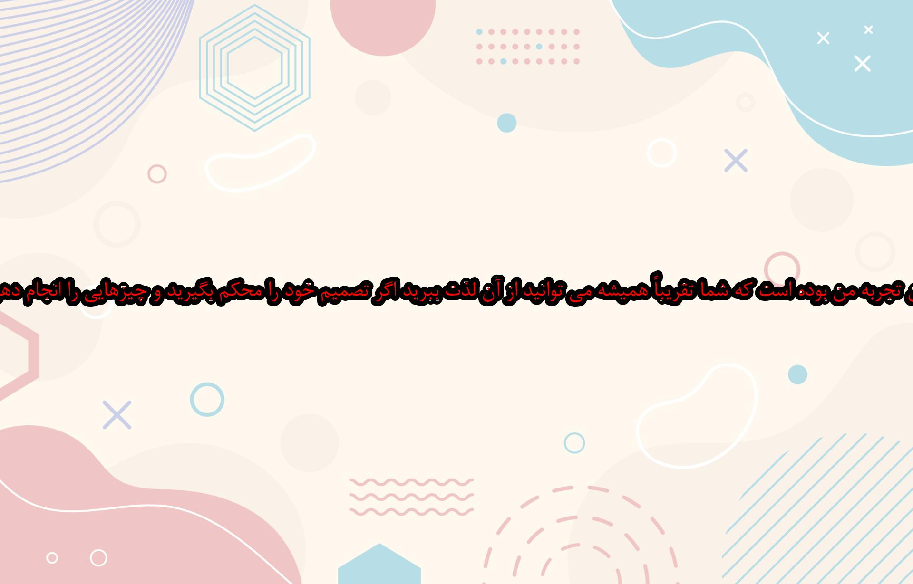

<h1>Image crawler</h1> 
<b>Abdullah Mohammadi abdhmohammady@gmail.com</b>  
The result of this table is collected based on crawling the web with the term 'AnneShirleyQuotes'. 
After collecting about 100 images with the theme of 'Anne Shirley's Quotes', we extracted the 
text of the images and placed the Persian translation on a new image.  
In the table below: 
The 'Quotes' column from the search results of 'AnneShirleyQuotes', 
The 'Wallpapers' column from the search results of 'sunny' and 
The 'Generated' column are processed results.  
<table align='center' border='1'>
<tr>
	<td align='center'><h1>Quote</h1></td>
	<td align='center'><h1>Background</h1></td>
	<td align='center'><h1>Last File</h1></td>
</tr><tr>
	<td></td>
	<td></td>
	<td></td>
</tr><tr>
	<td></td>
	<td></td>
	<td></td>
</tr><tr>
	<td></td>
	<td></td>
	<td></td>
</tr><tr>
	<td></td>
	<td></td>
	<td></td>
</tr><tr>
	<td></td>
	<td></td>
	<td></td>
</tr><tr>
	<td></td>
	<td></td>
	<td></td>
</tr><tr>
	<td></td>
	<td></td>
	<td></td>
</tr><tr>
	<td></td>
	<td></td>
	<td></td>
</tr><tr>
	<td></td>
	<td></td>
	<td></td>
</tr><tr>
	<td></td>
	<td></td>
	<td></td>
</tr><tr>
	<td></td>
	<td></td>
	<td></td>
</tr><tr>
	<td></td>
	<td></td>
	<td></td>
</tr><tr>
	<td></td>
	<td></td>
	<td></td>
</tr><tr>
	<td></td>
	<td></td>
	<td></td>
</tr><tr>
	<td></td>
	<td></td>
	<td></td>
</tr><tr>
	<td></td>
	<td></td>
	<td></td>
</tr><tr>
	<td></td>
	<td></td>
	<td></td>
</tr><tr>
	<td></td>
	<td></td>
	<td></td>
</tr><tr>
	<td></td>
	<td></td>
	<td></td>
</tr><tr>
	<td></td>
	<td></td>
	<td></td>
</tr><tr>
	<td></td>
	<td></td>
	<td></td>
</tr><tr>
	<td></td>
	<td></td>
	<td></td>
</tr><tr>
	<td></td>
	<td></td>
	<td></td>
</tr><tr>
	<td></td>
	<td></td>
	<td></td>
</tr><tr>
	<td></td>
	<td></td>
	<td></td>
</tr><tr>
	<td></td>
	<td></td>
	<td></td>
</tr><tr>
	<td></td>
	<td></td>
	<td></td>
</tr><tr>
	<td></td>
	<td></td>
	<td></td>
</tr><tr>
	<td></td>
	<td></td>
	<td></td>
</tr>
</table>